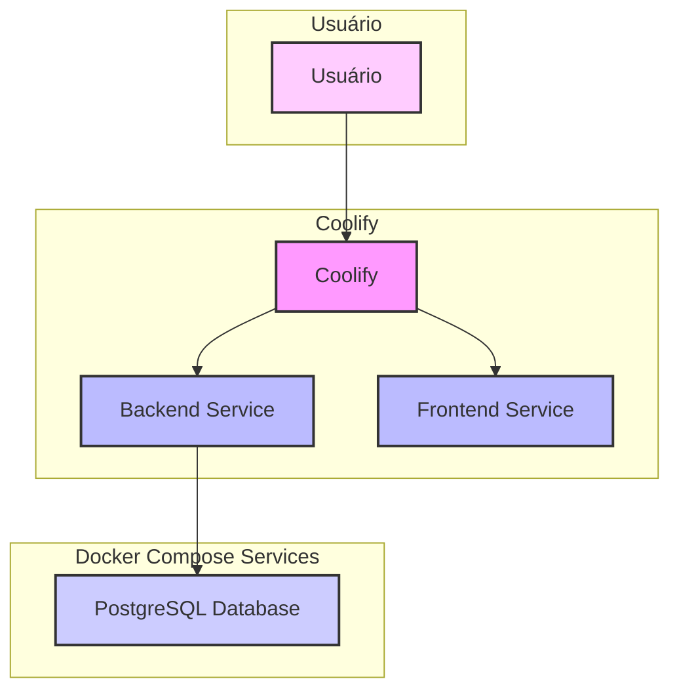

# Arquitetura de Deploy do EasyHolmes com Coolify

## Descrição da Arquitetura:

Esta arquitetura descreve o deploy do projeto EasyHolmes utilizando o Coolify como plataforma de orquestração, mantendo o banco de dados PostgreSQL dentro do Docker Compose.

- **Coolify**: Atua como o orquestrador principal, gerenciando a implantação, o escalonamento e o roteamento do tráfego para os serviços de backend e frontend.
- **Backend Service**:
    - Implantado como um serviço Docker no Coolify.
    - Conecta-se a uma instância de PostgreSQL que faz parte do mesmo Docker Compose.
    - Expõe sua API para o frontend através do proxy reverso do Coolify.
- **Frontend Service**:
    - Implantado como um serviço Docker no Coolify.
    - É uma aplicação web estática servida por um servidor Nginx.
    - Acessa a API do backend via proxy reverso configurado no Nginx do próprio frontend, eliminando a necessidade de uma variável de ambiente `VUE_APP_API_URL` para o frontend.
- **PostgreSQL Database (Docker Compose)**:
    - Um serviço de banco de dados PostgreSQL que é implantado junto com o backend e o frontend como parte do mesmo Docker Compose.
    - O backend se conecta a este banco de dados usando as configurações de rede do Docker Compose.
- **Usuário**: Acessa a aplicação através do Coolify, que direciona o tráfego para o frontend e, subsequentemente, para o backend.